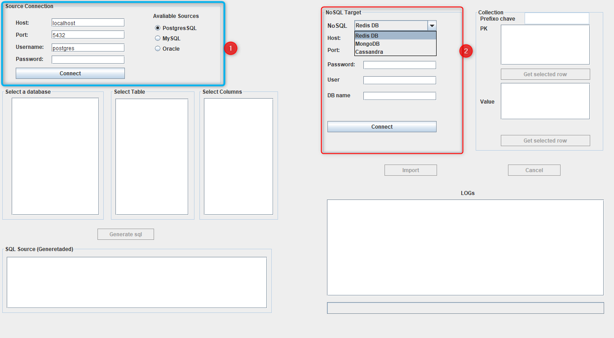

      _
       .~q`,
      {__,  \
          \' \
           \  \
            \  \
             \  `._            __.__
              \    ~-._  _.==~~     ~~--.._
               \        '                  ~-.
                \      _-   -_                `.
                 \    /       }        .-    .  \
                  `. |      /  }      (       ;  \
                    `|     /  /       (       :   '\
                     \    |  /        |      /       \
                      |     /`-.______.\     |~-.      \
                      |   |/           (     |   `.      \_
                      |   ||            ~\   \      '._    `-.._____..----..___
                      |   |/             _\   \         ~-.__________.-~~~~~~~~~'''
                    .o'___/            .o______}

# DINo
Tool for Data Insertion in NoSQL DBs.

[Artigo DINo](https://sol.sbc.org.br/index.php/erbd/article/view/2839/2801)

```bash
java -jar APP.jar
```
